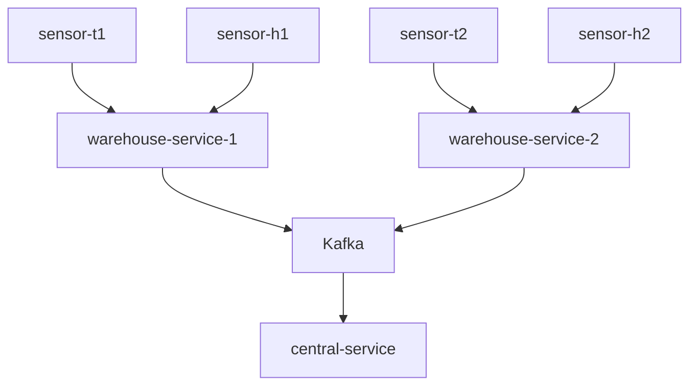

# metrics-monitoring
### Overview 

There is a warehouse equipped with various types of sensors that monitor environmental
conditions. These sensors provide measurements such as current temperature and
humidity, which are transmitted via UDP. The warehouse service interacts with all these
sensors and automatically publishes the measurements to a central monitoring service. This
service oversees multiple warehouses and activates an alarm if temperature or humidity
readings exceed configured thresholds.

## High level architecture


## Steps to run:
1. Build
```shell 
mvn clean package
```

2. Build warehouse-service docker images 
```shell 
cd warehouse-service 
docker build -t 'warehouse-service' . 
```

3. Build central-service docker images
```shell 
cd ..
cd central-service 
docker build -t 'central-service' .
```

4. Run docker compose
```shell
cd ..
docker compose run
```

## Testing:
1. Run shell 
```shell
seq 100 | xargs -I{} echo "sensor_id=t{}; value={}" | nc -u -w1 localhost 3344
```